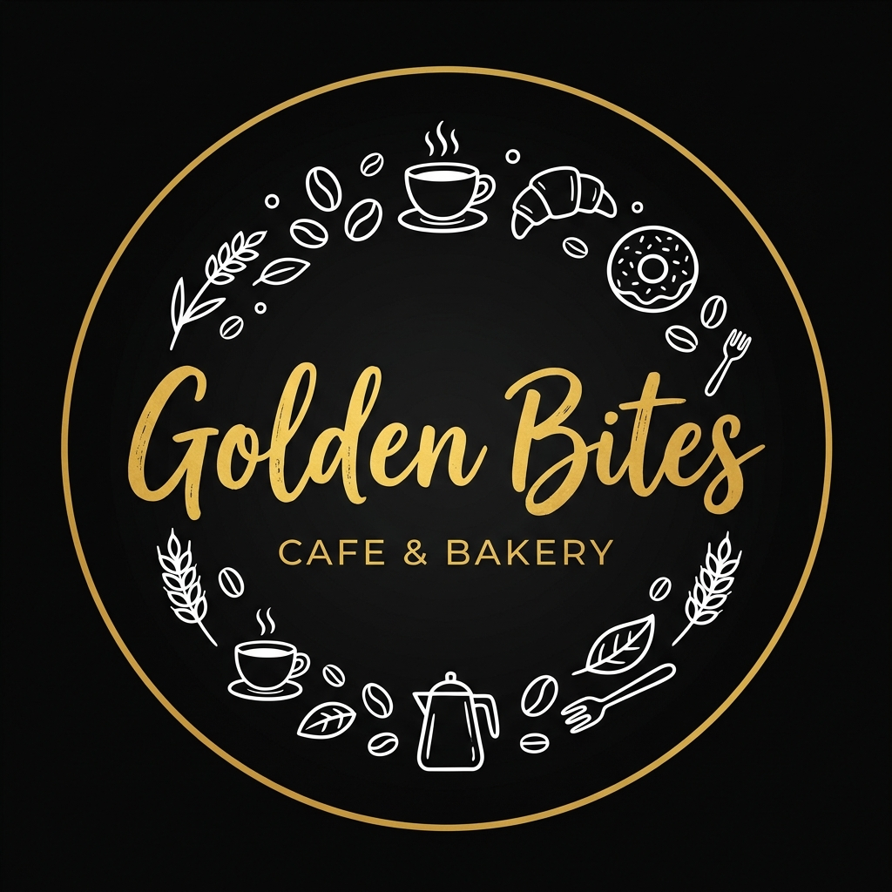

# Golden Bites - Premium Cafe Experience

A professional, high-end, and highly animated responsive website developed for the cafe brand **Golden Bites**. This project was executed as a premium freelance delivery, focusing on coffee culture, food experience, and brand storytelling.

<p align="center">
  
</p>

## Project Overview

The website follows modern UI/UX principles, utilizing smooth animations and storytelling scroll effects to create an immersive digital experience. It is designed to feel premium, warm, and inviting, reflecting the brand mood: Cozy, Youth-friendly, and Instagram-worthy.

## Key Features

- **Cinematic Hero Section**: Full-width parallax background with gold-gradient typography and a "scroll-reveal" tagline.
- **Storytelling Scroll Experience**: Content reveals dynamically as the user travels through the cafe's story and brand pillars.
- **Interactive Signature Menu**: Categorized product cards with hover "glow" effects and animated filtering.
- **High-Performance Scrollytelling**: Dedicated "Brand Pillars" section that transition horizontally to tell the Golden Bites story.
- **Client Testimonial Carousel**: Glassmorphism cards with star ratings and animated quote entries.
- **Integrated Contact & Location**: Location details with a stylized map and immediate WhatsApp call-to-action.

## Technical Implementation

- **Core Framework**: React (Vite environment)
- **Advanced Animations**: GSAP (ScrollTrigger) and Framer Motion for layout transitions.
- **Smooth Scroll**: Lenis implementation for premium feel across browsers and devices.
- **Styling**: Modern Vanilla CSS with CSS Variables and Glassmorphism effects.
- **Typography**: Playfair Display (Serif) and Outfit (Sans-serif) for an elegant hierarchy.

## Environment & Development

To run this project locally, ensure you have Node.js installed, then follow these steps:

1. Install all required dependencies:
   ```bash
   npm install
   ```

2. Start the development server:
   ```bash
   npm run dev
   ```

3. Open your browser and navigate to the local server address (typically http://localhost:5173).

## Freelance Delivery

This project was built for **Golden Bites** as part of a high-end freelance client delivery. The final result is optimized for performance, accessibility, and visual impact.

---
Copyright 2024 Golden Bites. All rights reserved.
